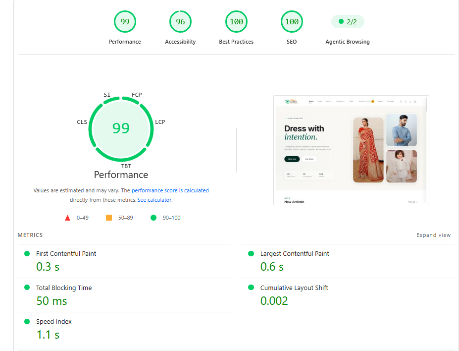
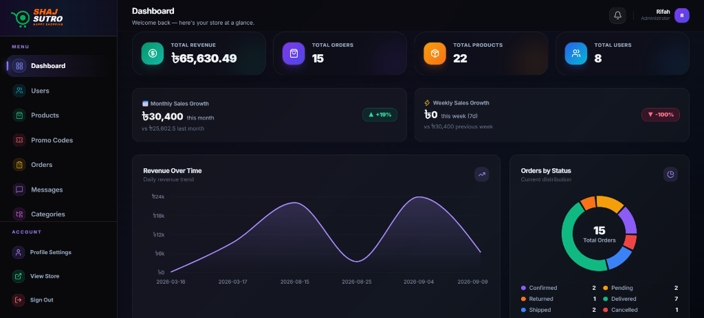
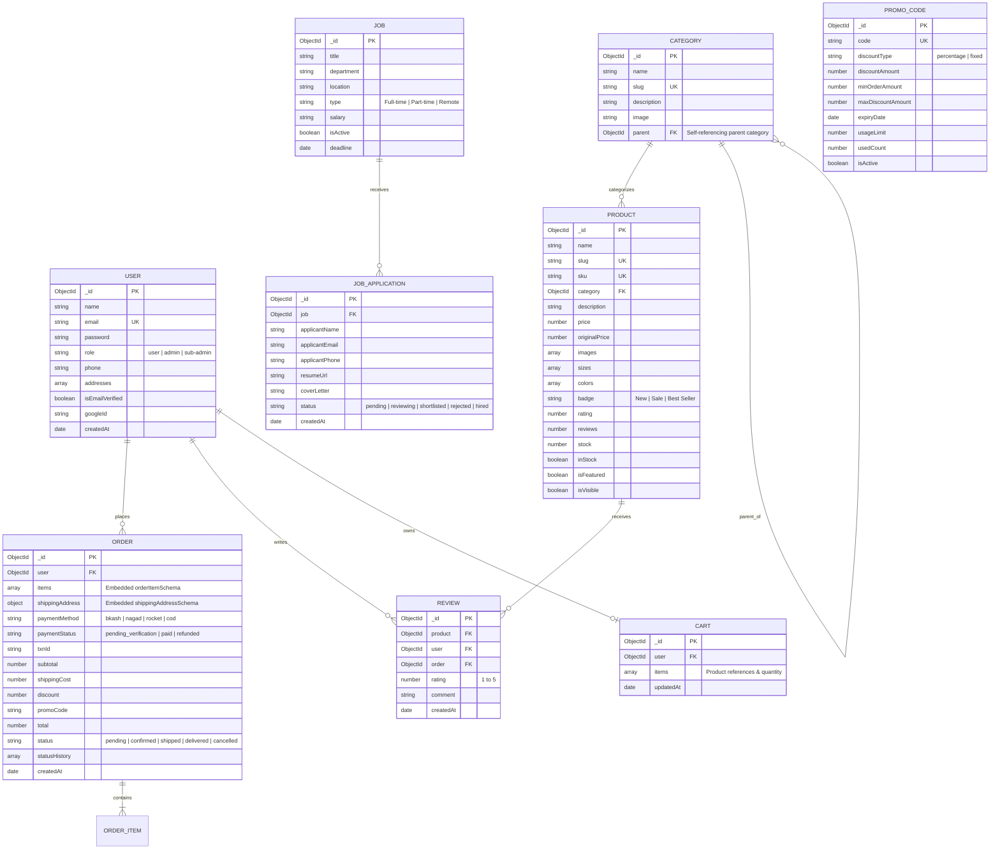

<div align="center">

<a href="https://github.com/JoyTarafder/Online_Shopping">
  
</a>

# 🛍️ ShajSutro (সাজসূত্র)
### Next-Generation Omnichannel E-Commerce & Retail Management Engine

[](https://github.com/JoyTarafder/Online_Shopping)
[](LICENSE)
[](https://nextjs.org/)
[](https://reactjs.org/)
[](https://www.typescriptlang.org/)
[](https://tailwindcss.com/)
[](https://nodejs.org/)
[](https://expressjs.com/)
[](https://www.mongodb.com/)

<p align="center">
  <b>Enterprise-ready, cloud-native digital storefront and back-office management suite tailored for high-scale fashion and lifestyle commerce.</b>
</p>

### 🏆 Google Lighthouse Production Audit Scores

[](#-performance--core-web-vitals)
[](#-performance--core-web-vitals)
[](#-performance--core-web-vitals)
[](#-performance--core-web-vitals)

<p align="center">
  <a href="#-executive-summary">Executive Summary</a> •
  <a href="#-performance--core-web-vitals">Performance</a> •
  <a href="#-application-previews">Screenshots</a> •
  <a href="#-system-architecture">System Architecture</a> •
  <a href="#-core-modules--feature-matrix">Feature Matrix</a> •
  <a href="#-security--compliance-architecture">Security</a> •
  <a href="#-data-models--entity-relationships">Data Models</a> •
  <a href="#-rest-api-specification">REST API</a> •
  <a href="#-environment-configuration">Configuration</a> •
  <a href="#-getting-started--deployment">Deployment</a>
</p>

---

</div>

## 📌 Executive Summary

**ShajSutro** is a modern, full-stack headless e-commerce ecosystem designed to solve the challenges of contemporary digital retail. It pairs an ultra-fast, search-optimized **Next.js 14 App Router** frontend with a robust, defensively architected **Express.js & MongoDB Atlas** micro-service backend.

The platform delivers a frictionless customer shopping journey alongside an operations hub featuring real-time business intelligence, dynamic logistics calculation (specialized for Bangladesh administrative divisions & districts), automated PDF invoice generation, multi-channel transactional notifications, and an integrated career management workflow.

### 🌟 Key Differentiators

* **⚡ Ultra-Low Latency UI**: Server-side rendering (SSR) & streaming hydration with React 18 and Next.js 14.
* **📍 Hyper-Localized Logistics Engine**: Native support for 8 Divisions, 64 Districts, and Upazilas with automatic shipping tier calculations.
* **🛡️ Zero-Trust Security Foundation**: Helmet security headers, dual-tier rate limiters, bcrypt hashing, and JWT token rotation.
* **📊 Live Operations Analytics**: Real-time sales telemetry, order trend graphs, and inventory metrics via Recharts.
* **📑 Automated PDF Invoicing**: High-fidelity dynamic PDF generation built with PDFKit for immediate customer receipts and warehouse dispatch.
* **👗 Interactive Virtual Try-On**: Dedicated studio interface for interactive apparel preview.

---

## ⚡ Performance & Core Web Vitals

ShajSutro achieves top-tier scores in Google Lighthouse production audits, meeting the highest standards for modern e-commerce speed, accessibility, security, and search engine optimization.

| Lighthouse Category | Score | Status |
|---|---|---|
| **⚡ Performance** | **99 / 100** | 🟢 Exceptional (All Web Vitals Green) |
| **♿ Accessibility** | **96 / 100** | 🟢 Fully Accessible (WCAG 2.1 AA Compliant) |
| **🛡️ Best Practices** | **100 / 100** | 🟢 Perfect (Security Headers, HTTPS, Modern Formats) |
| **🔍 SEO** | **100 / 100** | 🟢 Perfect (Semantic HTML, Meta Tags, Rich Previews) |

### 📊 Field & Lab Metrics Breakdown

| Metric | Measured Score | Google Threshold | Status |
|---|---|---|---|
| **First Contentful Paint (FCP)** | **0.3 s** | `< 1.8 s` | 🟢 Instantaneous First Render |
| **Largest Contentful Paint (LCP)** | **0.6 s** | `< 2.5 s` | 🟢 Hero Content Visible in 600ms |
| **Total Blocking Time (TBT)** | **50 ms** | `< 200 ms` | 🟢 Zero Main-Thread CPU Freezes |
| **Cumulative Layout Shift (CLS)** | **0.002** | `< 0.1` | 🟢 Rock-Solid Visual Stability |
| **Speed Index (SI)** | **1.1 s** | `< 3.4 s` | 🟢 Rapid Perceived Page Completion |

<div align="center">
  
</div>

#### 🛠️ Key Performance Optimizations Implemented:
* **Next.js 14 Image Engine**: Dynamic responsive sizes (`sizes="100vw"` / `sizes="(max-width: 640px) 50vw, 25vw"`), automatic conversion to AVIF/WebP, and local asset fallbacks.
* **Layout Stability**: Zero layout shifts (`CLS: 0.002`) by eliminating non-composited infinite CSS transforms from critical above-the-fold hero elements.
* **Server-Side Hydration Pre-population**: Instant SSR HTML delivery for catalog sections, removing empty client skeleton flashing and eliminating redundant mounting network waterfalls.
* **Security & Best Practices**: Production-grade HTTP security headers (`X-Content-Type-Options: nosniff`, `X-Frame-Options: SAMEORIGIN`, `Referrer-Policy: strict-origin-when-cross-origin`) and WCAG-compliant touch targets (`min-w-[28px] min-h-[28px]`).

---

## 📸 Application Previews

### 🛍️ 1. Storefront (Customer Experience)
*Ultra-fast, responsive storefront with minimalist aesthetics, dynamic mega-categories, smart promo banners, and instant product discovery.*

<div align="center">
  
</div>

<br/>

### 🛡️ 2. Admin Operations Portal (Executive Control Suite)
*Sleek dark-mode back-office dashboard featuring live sales velocity graphs, order fulfillment breakdown, revenue telemetry, and inventory management.*

<div align="center">
  
</div>

<br/>

### 🏆 3. Google Lighthouse 99% Performance Audit Proof
*Verified production performance audit: 99 Performance, 96 Accessibility, 100 Best Practices, 100 SEO, and 0.3s FCP.*

<div align="center">
  
</div>

---

## 🏗️ System Architecture

```mermaid
flowchart TD

subgraph group_presentation["Customer and Admin UI"]
  node_storefront["Storefront UI<br/>[layout.tsx]"]
  node_admin_ui["Admin Portal<br/>[layout.tsx]"]
  node_tryon_ui["Virtual Try-On<br/>[page.tsx]"]
end

subgraph group_gateway["API Gateway"]
  node_product_proxy["Product API Proxy<br/>[route.ts]"]
  node_tryon_submit["Try-On Submit API<br/>[route.ts]"]
  node_tryon_status["Try-On Status API<br/>[route.ts]"]
  node_express_api["Express API<br/>[server.ts]"]
  node_auth_routes["Auth Routes<br/>[auth.routes.ts]"]
  node_commerce_routes["Commerce Routes<br/>[product.routes.ts]"]
  node_admin_routes["Admin Routes<br/>[admin.routes.ts]"]
end

subgraph group_commerce["Commerce Domains"]
  node_auth_controller["Auth Controller<br/>[auth.controller.ts]"]
  node_catalog_controller["Catalog Controller"]
  node_order_controller["Order Checkout"]
  node_review_controller["Review Processor"]
  node_promo_controller["Promotion Manager"]
end

subgraph group_operations["Operations Services"]
  node_admin_controller["Admin Operations"]
  node_career_controller["Career Processor"]
  node_email_service["Email Dispatcher<br/>[emailService.ts]"]
  node_cache_service["Cache Manager<br/>[cache.service.ts]"]
end

subgraph group_persistence["Persistence Integrations"]
  node_mongodb[("MongoDB Database<br/>[db.ts]")]
  node_redis[("Redis Cache<br/>[redis.ts]")]
end

node_browser(("Web Browser"))
node_smtp["SMTP Relay"]
node_lightx["LightX Try-On"]
node_google_oauth["Google Identity"]
node_upload_storage[("Resume Storage")]

node_browser -->|"opens"| node_storefront
node_browser -->|"opens"| node_admin_ui
node_storefront -->|"fetches catalog"| node_product_proxy
node_product_proxy -->|"proxies products"| node_express_api
node_product_proxy -.->|"falls back"| node_catalog_controller
node_storefront -->|"calls API"| node_express_api
node_admin_ui -->|"calls API"| node_express_api
node_tryon_ui -->|"submits images"| node_tryon_submit
node_tryon_ui -->|"polls status"| node_tryon_status
node_tryon_submit -.->|"starts job"| node_lightx
node_tryon_status -.->|"checks job"| node_lightx
node_express_api -->|"dispatches"| node_auth_routes
node_express_api -->|"dispatches"| node_commerce_routes
node_express_api -->|"dispatches"| node_admin_routes
node_auth_routes -->|"routes requests"| node_auth_controller
node_commerce_routes -->|"routes catalog"| node_catalog_controller
node_commerce_routes -->|"routes orders"| node_order_controller
node_commerce_routes -->|"routes reviews"| node_review_controller
node_commerce_routes -->|"routes promotions"| node_promo_controller
node_admin_routes -->|"routes operations"| node_admin_controller
node_auth_controller -->|"reads and writes"| node_mongodb
node_auth_controller -->|"sends verification"| node_email_service
node_auth_controller -.->|"authenticates with"| node_google_oauth
node_catalog_controller -->|"reads catalog"| node_mongodb
node_catalog_controller -->|"uses cache"| node_cache_service
node_order_controller -->|"persists orders"| node_mongodb
node_order_controller -->|"sends updates"| node_email_service
node_review_controller -->|"stores reviews"| node_mongodb
node_review_controller -->|"clears product cache"| node_cache_service
node_promo_controller -->|"stores promotions"| node_mongodb
node_admin_controller -->|"manages records"| node_mongodb
node_admin_controller -->|"broadcasts email"| node_email_service
node_career_controller -->|"stores applications"| node_mongodb
node_career_controller -->|"stores resumes"| node_upload_storage
node_email_service -.->|"delivers mail"| node_smtp
node_cache_service -.->|"reads and writes"| node_redis

click node_storefront "https://github.com/joytarafder/shajsutro_/blob/main/src/app/(store)/layout.tsx"
click node_admin_ui "https://github.com/joytarafder/shajsutro_/blob/main/src/app/admin/layout.tsx"
click node_tryon_ui "https://github.com/joytarafder/shajsutro_/blob/main/src/app/(store)/virtual-try-on/page.tsx"
click node_product_proxy "https://github.com/joytarafder/shajsutro_/blob/main/src/app/api/products/route.ts"
click node_tryon_submit "https://github.com/joytarafder/shajsutro_/blob/main/src/app/api/virtual-try-on/route.ts"
click node_tryon_status "https://github.com/joytarafder/shajsutro_/blob/main/src/app/api/virtual-try-on/status/route.ts"
click node_express_api "https://github.com/joytarafder/shajsutro_/blob/main/backend/src/server.ts"
click node_auth_routes "https://github.com/joytarafder/shajsutro_/blob/main/backend/src/routes/auth.routes.ts"
click node_commerce_routes "https://github.com/joytarafder/shajsutro_/blob/main/backend/src/routes/product.routes.ts"
click node_admin_routes "https://github.com/joytarafder/shajsutro_/blob/main/backend/src/routes/admin.routes.ts"
click node_auth_controller "https://github.com/joytarafder/shajsutro_/blob/main/backend/src/controllers/auth.controller.ts"
click node_catalog_controller "https://github.com/joytarafder/shajsutro_/blob/main/backend/src/controllers/product.controller.ts"
click node_order_controller "https://github.com/joytarafder/shajsutro_/blob/main/backend/src/controllers/order.controller.ts"
click node_review_controller "https://github.com/joytarafder/shajsutro_/blob/main/backend/src/controllers/review.controller.ts"
click node_promo_controller "https://github.com/joytarafder/shajsutro_/blob/main/backend/src/controllers/promoCode.controller.ts"
click node_admin_controller "https://github.com/joytarafder/shajsutro_/blob/main/backend/src/controllers/admin.controller.ts"
click node_career_controller "https://github.com/joytarafder/shajsutro_/blob/main/backend/src/controllers/jobApplication.controller.ts"
click node_email_service "https://github.com/joytarafder/shajsutro_/blob/main/backend/src/services/emailService.ts"
click node_cache_service "https://github.com/joytarafder/shajsutro_/blob/main/backend/src/services/cache.service.ts"
click node_mongodb "https://github.com/joytarafder/shajsutro_/blob/main/backend/src/config/db.ts"
click node_redis "https://github.com/joytarafder/shajsutro_/blob/main/backend/src/config/redis.ts"

classDef toneNeutral fill:#f8fafc,stroke:#334155,stroke-width:1.5px,color:#0f172a
classDef toneBlue fill:#dbeafe,stroke:#2563eb,stroke-width:1.5px,color:#172554
classDef toneAmber fill:#fef3c7,stroke:#d97706,stroke-width:1.5px,color:#78350f
classDef toneMint fill:#dcfce7,stroke:#16a34a,stroke-width:1.5px,color:#14532d
classDef toneRose fill:#ffe4e6,stroke:#e11d48,stroke-width:1.5px,color:#881337
classDef toneIndigo fill:#e0e7ff,stroke:#4f46e5,stroke-width:1.5px,color:#312e81
classDef toneTeal fill:#ccfbf1,stroke:#0f766e,stroke-width:1.5px,color:#134e4a
class node_storefront,node_admin_ui,node_tryon_ui,node_browser toneBlue
class node_product_proxy,node_tryon_submit,node_tryon_status,node_express_api,node_auth_routes,node_commerce_routes,node_admin_routes,node_upload_storage toneAmber
class node_auth_controller,node_catalog_controller,node_order_controller,node_review_controller,node_promo_controller toneMint
class node_admin_controller,node_career_controller,node_email_service,node_cache_service toneRose
class node_mongodb,node_redis,node_smtp,node_lightx,node_google_oauth toneIndigo
```



---

## 🎯 Core Modules & Feature Matrix

### 🛍️ 1. Customer Experience (Storefront)

| Capability | Technical Implementation | Highlights |
|---|---|---|
| **Catalog & Navigation** | Next.js dynamic routing, query state sync | Multi-facet filtering by category, price range, color swatches, sizes, and instant client search. |
| **Product Detail Experience** | Responsive gallery, dynamic stock check | High-res image carousel, color/size variant selectors, customer reviews, verified buyer badges, and related items. |
| **Interactive Virtual Try-On** | Canvas / Web interactive studio (`/virtual-try-on`) | Interactive apparel preview for enhanced customer engagement and lower return rates. |
| **Cart & Wishlist** | React Context + LocalStorage persistence | Real-time stock reservation check, coupon validation drawer, and sync across page reloads. |
| **Localized Checkout** | BD Administrative Location Dataset | Automated shipping fee differentiation (Inside Dhaka vs. Outside Dhaka / Inter-division rates), Cash on Delivery (COD) & Online payments. |
| **Real-Time Order Tracking** | Public API lookup (`/api/orders/track`) | Order lookup by Tracking ID + Phone/Email with visual timeline (`Pending` ➔ `Processing` ➔ `Shipped` ➔ `Delivered`). |
| **Customer Portal** | JWT Auth with session protection | Profile updating, saved address books, order tracking, and dynamic PDF invoice downloads. |
| **Interactive Careers Portal** | Multipart file upload via Multer | Open positions browser with direct PDF resume / CV attachment processing. |

---

### 🛡️ 2. Back-Office Operations (Admin Suite)

| Administrative Module | Route | Capabilities |
|---|---|---|
| **Executive Analytics** | `/admin/dashboard` | Visual KPI tracking (Gross Sales, Net Revenue, Monthly Trends, Top 5 Products, Low-Stock Warnings) rendered with **Recharts**. |
| **Catalog Management** | `/admin/products` | Add/Edit/Archive SKUs, multi-image upload handler, variant pricing, color mapping, automated SKU generation. |
| **Category Hierarchy** | `/admin/categories` | Dynamic nested categories, automated URL slugification, and icon management. |
| **Order Processing** | `/admin/orders` | Order state machine transitions, customer contact records, shipping manifests, and **instant PDF invoice generation**. |
| **Promotions Engine** | `/admin/promo-codes` | Percentage vs. fixed amount discounts, expiry thresholds, minimum spend constraints, and total redemption limits. |
| **Talent Acquisition** | `/admin/applications` | Review incoming candidate resumes, track screening statuses, and download CV files directly. |
| **Customer Communications** | `/admin/messages` | Centralized customer inquiry inbox with read/unread flags and message threading. |
| **System Notifications** | `/admin/notifications` | Real-time in-app alerts for critical order events, out-of-stock items, and applicant actions. |
| **Audience Growth** | `/admin/subscribers` | Newsletter subscriber registry with automated welcome discount coupon dispatch. |

---

## 🔒 Security & Compliance Architecture

ShajSutro is engineered with a **Defense-in-Depth** multi-layered security model across client, gateway, service, database, and file storage layers to safeguard customer credentials, prevent unauthorized access, and protect financial transaction integrity.

```
                                      Security Defense In-Depth
 ┌───────────────────────────────────────────────────────────────────────────────────────────────────┐
 │ 1. Perimeter & Boundary Defense: Helmet.js Security Headers + Strict CORS + Disabled X-Powered-By │
 ├───────────────────────────────────────────────────────────────────────────────────────────────────┤
 │ 2. DoS & Brute-Force Defense: Multi-Tier Rate Limiting (General, Auth Guards, Order Tracking)     │
 ├───────────────────────────────────────────────────────────────────────────────────────────────────┤
 │ 3. Identity & Credential Security: Bcrypt (12 Salt Rounds) + Signed JWT + Double-Opt-In OTP       │
 ├───────────────────────────────────────────────────────────────────────────────────────────────────┤
 │ 4. Authorization & RBAC: Customer ↔ Sub-Admin (9 Granular Module Permissions) ↔ Root Admin        │
 ├───────────────────────────────────────────────────────────────────────────────────────────────────┤
 │ 5. Transaction & Financial Anti-Tampering: Server-Side Price Verification + Atomic Stock Check    │
 ├───────────────────────────────────────────────────────────────────────────────────────────────────┤
 │ 6. Input & Upload Hygiene: Mongoose Schema Sanitization + Multer MIME Whitelist + Path Traversal  │
 └───────────────────────────────────────────────────────────────────────────────────────────────────┘
```

### 🛡️ 1. Multi-Tier Rate Limiting & Anti-Brute Force Protection
*Implemented via `express-rate-limit` with reverse proxy IP resolution (`trust proxy: 1`):*
* **Authentication Gatekeeper (`authLimiter`)**: Strictly restricted to **25 attempts per 15-minute window** on `/api/auth/login`, `/api/auth/register`, `/api/auth/verify-email`, `/api/auth/forgot-password`, and `/api/auth/reset-password`. Thwarts credential stuffing, dictionary attacks, and automated OTP guessing.
* **OTP Enumeration Lockout**: Both email verification and password reset enforce a hard limit of **5 maximum incorrect attempts** (`attempts >= 5`). Once reached, the code is purged from the database and the request is locked with HTTP 429.
* **Order Tracking Safeguard (`trackLimiter`)**: Capped at **100 queries per 15 minutes** on the public `/api/orders/track` endpoint, preventing automated scrapers from mining customer phone numbers or order IDs.
* **General API Throttling (`generalLimiter`)**: Standard traffic limiter allowing **500 requests per 15 minutes** per IP to defend against Denial-of-Service (DoS) attacks.

### 🔐 2. Cryptographic Authentication & Account Lifecycle
* **12-Round Bcrypt Password Hashing**: Passwords are never saved in plaintext; hashed using `bcrypt.genSalt(12)` before saving. Password comparisons are executed using constant-time cryptographic comparisons.
* **Stateless JWT Authorization**: Stateless authentication via signed JSON Web Tokens (`jsonwebtoken`) with configurable expiration (`JWT_EXPIRES_IN=7d`) and server-side secret verification.
* **Staging Sandbox Registration (Double-Opt-In)**: Unverified signups are kept in an isolated `PendingUser` collection with temporary TTL. Accounts only migrate to the primary `User` collection upon valid 6-digit OTP verification.
* **Token Invalidation on Password Change**: Tracks `passwordChangedAt` timestamp. If a user updates their password, previously issued JWT tokens become immediately obsolete.
* **Cryptographically Verified Google OAuth 2.0**: Validates token authenticity against Google's OAuth2 endpoints (`https://oauth2.googleapis.com/tokeninfo`). Auto-generates a secure 32-byte cryptographic password (`crypto.randomBytes(32).toString('hex')`) for Google users.
* **Instant Account Revocation (`isBlocked`)**: Any user blocked by an administrator is immediately rejected upon login and on every authenticated API call with HTTP 403 Forbidden.

### 👑 3. Role-Based Access Control (RBAC) & Principle of Least Privilege
* **Layered Route Guards**:
  - `protect`: Validates the Bearer token, decodes payload, and injects the active user into `req.user` while omitting sensitive fields.
  - `adminOnly`: Restricts access strictly to administrative personnel (`admin` and `sub-admin`).
  - `rootAdminOnly`: Dedicated guard enforcing root-admin exclusive privileges for managing administrative team members and modifying privilege matrices.
* **Granular Sub-Admin Permissions Matrix**: Sub-administrators can be restricted individually per functional module:
  - `dashboard` • `products` • `orders` • `users` • `categories` • `promoCodes` • `notifications` • `jobs` • `messages`
* **Horizontal Privilege Separation (IDOR Prevention)**: Customers can only query, inspect, cancel, or download PDF invoices for orders that belong strictly to their own user ID (`req.user._id === order.user`).

### 💰 4. Transaction Integrity & E-Commerce Anti-Tampering
* **Zero-Trust Pricing Architecture**: Client-side prices in cart and checkout payloads are **completely ignored**. The backend fetches each SKU directly from MongoDB and recalculates item subtotals, VAT, shipping tiers, and discounts strictly from verified database records.
* **Atomic Stock Reservation**: Verifies real-time stock levels before accepting orders; prevents negative stock levels or race conditions during flash sales.
* **Server-Side Promo Code Governance**: Validates coupon codes against minimum order requirements, valid date windows, expiry dates, and total usage caps server-side before applying discounts.
* **Immutable Payment Transaction Audit**: Mobile banking payment transaction IDs (`bkash`, `nagad`, `rocket`) and payment verification states are permanently logged in the order lifecycle.

### 🌐 5. Perimeter Defense & HTTP Security Headers
* **Helmet.js Protection**: Automatically sets secure HTTP response headers (`X-Content-Type-Options: nosniff`, `X-Frame-Options: SAMEORIGIN`, `Cross-Origin-Resource-Policy: cross-origin`, etc.) to defend against MIME sniffing, Clickjacking, and Cross-Site Scripting (XSS).
* **Information Disclosure Prevention**: `app.disable("x-powered-by")` removes the Express fingerprint from all HTTP responses to reduce reconnaissance attack surfaces.
* **Dynamic CORS Whitelisting**: Strict Cross-Origin Resource Sharing policy validating incoming origins against environment-defined URLs (`CLIENT_URL`), production domains, and authorized Vercel preview environments with credentials support.

### 📦 6. Input Sanitization & File Upload Defense
* **Sensitive Field Protection (`select: false`)**: Fields like `password`, `verificationCode`, `verificationCodeExpiry`, `verificationAttempts`, `passwordResetCode`, and `passwordResetAttempts` are excluded by default in Mongoose queries, preventing accidental exposure in JSON API payloads.
* **Strict MIME-Type File Whitelist**: Job application CV uploads via Multer are strictly restricted to `application/pdf`, `application/msword`, and `application/vnd.openxmlformats-officedocument.wordprocessingml.document`. Executables and scripts are rejected immediately.
* **File Size Constraint**: Multipart uploads are hard-capped at **8 MB** to protect storage and network bandwidth.
* **Path Traversal & Filename Sanitization**: Uploaded files have their names sanitized using regex `replace(/[^\w.\-]+/g, "_")` to prevent directory traversal (`../../`) and special-character injection attacks.
* **React/Next.js Client-Side Sanitization**: Automatic JSX string escaping prevents Stored and Reflected XSS across all customer and admin views.

---

### 📋 সিকিউরিটি ফিচারের সারাংশ (Security Highlights at a Glance)

| সিকিউরিটি ক্যাটাগরি | ব্যবহৃত প্রযুক্তি / মেকানিজম | কাজের ভূমিকা ও নিরাপত্তা সুবিধা |
|---|---|---|
| **পাসওয়ার্ড হ্যাশিং** | `bcryptjs` (12 Salt Rounds) | পাসওয়ার্ড প্লেইন টেক্সটে সংরক্ষিত হয় না; ১২ রাউন্ড সল্টিংয়ের মাধ্যমে রেইনবো টেবিল ও ব্রুট-ফোর্স রোধ। |
| **অথেনটিকেশন ও সেশন** | JWT (JSON Web Tokens) | সিক্রেট কি দ্বারা সাইন করা স্টেটলেস টোকেন ও এক্সপায়ারি ম্যানেজমেন্ট। |
| **ব্রুট-ফোর্স প্রতিরোধ** | `express-rate-limit` | লগইন ও রেজিস্ট্রেশন এন্ডপয়েন্টে ১৫ মিনিটে সর্বোচ্চ ২৫ বার চেষ্টার লিমিট। |
| **OTP নিরাপত্তা ও লকআউট** | 6-Digit OTP + 5-Attempt Lockout | সর্বোচ্চ ৫ বার ভুল কোড দিলে OTP স্বয়ংক্রিয়ভাবে বাতিল হয়ে রিকোয়েস্ট ব্লক হয়। |
| **অর্ডার রেট লিমিটিং** | `trackLimiter` (100 req / 15 min) | পাবলিক অর্ডার ট্র্যাকিং এপিআই থেকে ডেটা স্ক্র্যাপিং ও স্প্যামিং প্রতিরোধ। |
| **অ্যাডমিন রোল ও পারমিশন** | RBAC (`root_admin`, `sub_admin`, `user`) | রুট অ্যাডমিন ছাড়া সাব-অ্যাডমিন পারমিশন পরিবর্তন অসম্ভব; ৯টি মডিউলের আলাদা কন্ট্রোল। |
| **মূল্য কারচুপি প্রতিরোধ** | Server-Side Price Verification | ফ্রন্টএন্ড থেকে পাঠানো প্রাইস অগ্রাহ্য করে ডাটাবেজ থেকে আসল প্রাইস দিয়ে টোটাল হিসাব। |
| **স্টক ওভারসেলিং প্রতিরোধ** | Atomic Stock Check & Reservation | স্টক ০ হলে অর্ডার ব্লক করা এবং একই সাথে একাধিক অর্ডারে স্টক নেগেটিভ হওয়া বন্ধ রাখা। |
| **এইচটিটিপি হেডার ও ফিল্টারিং** | `helmet` + `cors` | ক্লিকজ্যাকিং, মাইম স্নিফিং ও অননুমোদিত ডোমেইন থেকে এপিআই কল প্রতিরোধ। |
| **সার্ভার ফিঙ্গারপ্রিন্ট হাইডিং** | `disable("x-powered-by")` | সার্ভার যে Express বা Node-এ চলছে তা এক্সপোজ না করে সাইবার হামলাকারীদের তথ্য গোপন রাখা। |
| **ফাইল আপলোড নিরাপত্তা** | `multer` Whitelist + Regex Sanitize | সিভি আপলোডে কেবল PDF/DOC/DOCX অনুমতি; ফাইল সাইজ ৮ এমবি লিমিট এবং পাথ ট্রাভার্সাল রোধ। |
| **ডাটাবেজ সেনসিটিভ ডাটা প্রটেকশন** | Mongoose `select: false` | কুয়েরি করার সময় পাসওয়ার্ড ও ওটিপি কোড যাতে ভুলে এপিআই রেসপন্সে না যায় তা নিশ্চিত করা। |
| **অ্যাকাউন্ট ব্লক সিস্টেম** | `isBlocked` Middleware Validation | অ্যাডমিন কোনো সন্দেহজনক ইউজার ব্লক করলে সাথে সাথে তার সমস্ত এক্সেস বন্ধ হওয়া। |

---

## 🗄️ Data Models & Entity Relationships



---

## 🔌 REST API Specification

### Authentication & User Lifecycle (`/api/auth`)

| Endpoint | Verb | Auth | Body / Query | Description |
|---|---|---|---|---|
| `/register` | `POST` | Public | `{ name, email, password, phone }` | Initiates registration & dispatches 6-digit OTP |
| `/verify-email` | `POST` | Public | `{ email, otp }` | Validates OTP and creates activated user account |
| `/resend-otp` | `POST` | Public | `{ email }` | Dispatches fresh OTP code |
| `/login` | `POST` | Public | `{ email, password }` | Authenticates user & returns JWT token + user profile |
| `/google` | `POST` | Public | `{ credential }` | Google OAuth token exchange & sign-in |
| `/forgot-password`| `POST` | Public | `{ email }` | Sends password reset token email |
| `/reset-password` | `POST` | Public | `{ token, password }` | Resets account password |
| `/me` | `GET` | Bearer | — | Fetches authenticated profile |
| `/profile` | `PUT` | Bearer | `{ name, phone, address, ... }` | Updates authenticated profile |

### Product Catalog & Categories (`/api/products`, `/api/categories`)

| Endpoint | Verb | Auth | Parameters / Body | Description |
|---|---|---|---|---|
| `/api/categories` | `GET` | Public | — | List all categories with active product counts |
| `/api/categories` | `POST` | Admin | `{ name, image, description }` | Create a new category |
| `/api/products` | `GET` | Public | `?category=&search=&sort=&page=` | Query catalog with pagination and faceted filters |
| `/api/products/:id`| `GET` | Public | `idOrSlug` | Retrieve product details by ID or URL slug |
| `/api/products` | `POST` | Admin | `{ title, price, stock, category, images... }` | Create product with auto-generated SKU |
| `/api/products/:id`| `PUT` | Admin | Product updates | Update product pricing, images, or stock |
| `/api/products/:id`| `DELETE`| Admin | — | Remove product from catalog |

### Orders & Checkout (`/api/orders`)

| Endpoint | Verb | Auth | Body / Params | Description |
|---|---|---|---|---|
| `/api/orders` | `POST` | Public/User | `{ items, shippingAddress, promoCode, paymentMethod }` | Places customer order & triggers confirmation email |
| `/api/orders/track`| `POST` | Public | `{ orderNumber, query }` | Public order lookup with status progression |
| `/api/orders/my-orders` | `GET` | Bearer | — | Customer order history |
| `/api/orders/:id/invoice`| `GET` | User/Admin | `orderId` | Generates and streams dynamic PDF invoice |
| `/api/orders` | `GET` | Admin | `?status=&page=&limit=` | Admin master order ledger |
| `/api/orders/:id/status` | `PUT` | Admin | `{ status }` | Transitions order state & dispatches status notification |

### Operations, Marketing & Support

| Endpoint | Verb | Auth | Description |
|---|---|---|---|
| `/api/promo-codes/validate` | `POST` | Public | Validates coupon rules against current cart state |
| `/api/promo-codes` | `POST` | Admin | Creates promotional discount campaign |
| `/api/job-applications` | `POST` | Public (Multer) | Receives job candidate application with PDF resume |
| `/api/job-applications` | `GET` | Admin | Lists applicants with resume preview links |
| `/api/contact` | `POST` | Public | Ingests customer support message |
| `/api/newsletter/subscribe`| `POST` | Public | Registers subscriber & sends welcome promo code |
| `/api/stats/overview` | `GET` | Admin | Aggregated analytics telemetry (sales, revenue, orders) |
| `/api/notifications` | `GET` | Admin | Live administrative notification feed |

---

## ⚙️ Environment Configuration

### Frontend Settings: `.env.local`
Place this in the root project directory:

```ini
# ==============================================================================
# SHAJSUTRO FRONTEND CONFIGURATION
# ==============================================================================

# Backend REST API Base URL (Without trailing slash)
NEXT_PUBLIC_API_URL=http://localhost:4000

# Google OAuth 2.0 Client ID (Obtained from Google Cloud Console)
NEXT_PUBLIC_GOOGLE_CLIENT_ID=your-google-client-id.apps.googleusercontent.com
```

### Backend Settings: `backend/.env`
Place this in the `backend/` directory:

```ini
# ==============================================================================
# SHAJSUTRO BACKEND CONFIGURATION
# ==============================================================================

# Environment & Server Port
PORT=4000
NODE_ENV=development

# MongoDB Connection String (Atlas Cluster or Local Instance)
MONGODB_URI=mongodb+srv://<username>:<password>@cluster0.mongodb.net/shajsutro?retryWrites=true&w=majority

# JSON Web Token Secret & Expiry
JWT_SECRET=super_secret_jwt_encryption_key_change_in_production_min_32_chars
JWT_EXPIRE=7d

# CORS Allowed Client Domains (Comma-separated)
CLIENT_URL=http://localhost:3000,http://localhost:3001,https://your-production-domain.com

# SMTP Mail Dispatcher Configuration
SMTP_HOST=smtp.gmail.com
SMTP_PORT=587
SMTP_SECURE=false
SMTP_USER=your-business-email@gmail.com
SMTP_PASS=your-gmail-app-password
EMAIL_FROM="ShajSutro <no-reply@shajsutro.com>"

# File Upload Storage Directory
UPLOAD_DIR=uploads
```

---

## 🚀 Getting Started & Deployment

### 1. Prerequisites Check
* **Node.js**: `v20.x LTS` recommended (minimum `v18.17.0`)
* **npm**: `v9.x` or `v10.x`
* **MongoDB**: Atlas Cloud Cluster or Local Community Server

---

### 2. Local Development Setup

```bash
# 1. Clone the repository
git clone https://github.com/JoyTarafder/Online_Shopping.git
cd Online_Shopping

# 2. Install root & frontend dependencies
npm install

# 3. Install backend dependencies
cd backend
npm install
cd ..
```

---

### 3. Database Initialization & Seeding

```bash
cd backend

# Create Initial Superadmin User
npx ts-node src/seed/createAdmin.ts

# Populate Demo Catalog (Categories, Products, Images)
npx ts-node src/seed/createDemoProducts.ts

# (Optional) Verify SMTP Transporter Connectivity
npx ts-node src/seed/testEmailTransporter.ts

cd ..
```

---

### 4. Running the Complete Development Cluster

Open two terminal sessions:

#### Terminal 1: Backend API Engine
```bash
cd backend
npm run dev
# -> Express server active at http://localhost:4000
```

#### Terminal 2: Next.js Frontend Application
```bash
# From workspace root
npm run dev
# -> Storefront active at http://localhost:3000
# -> Admin Portal active at http://localhost:3000/admin
```

---

## 📦 Production Build & Deployment

### Frontend (Vercel)
1. Push codebase to GitHub/GitLab.
2. Import project into **Vercel**.
3. Set **Framework Preset**: `Next.js`.
4. Inject environment variables:
   * `NEXT_PUBLIC_API_URL` ➔ `https://api.yourdomain.com`
   * `NEXT_PUBLIC_GOOGLE_CLIENT_ID` ➔ `your-client-id`
5. Trigger build (`npm run build`).

### Backend (Render / Railway / DigitalOcean / AWS EC2)
1. Provision a Node.js runtime container.
2. Configure environment variables matching `backend/.env`.
3. Set Build Command:
   ```bash
   npm install && npm run build
   ```
4. Set Start Command:
   ```bash
   npm run start
   ```
5. Configure reverse proxy (e.g. NGINX) with SSL termination via Let's Encrypt.

---

## 🧪 Quality Assurance & Scripts

| Scope | Command | Purpose |
|---|---|---|
| **Frontend** | `npm run build` | Validates TypeScript types and outputs optimized Next.js bundle |
| **Frontend** | `npm run lint` | Runs Next.js ESLint verification |
| **Backend** | `npm run build` | Compiles TypeScript into production JavaScript in `dist/` |
| **Backend** | `npm run lint` | Validates TypeScript types without code emission (`tsc --noEmit`) |
| **Backend** | `npm run start` | Boots compiled high-performance Node.js production server |

---


## 📄 License

Distributed under the **MIT License**. See `LICENSE` for more information.

---

<div align="center">
  <sub>Engineered with precision for the modern retail landscape.</sub>
  <br />
  <b>© 2026 ShajSutro. All rights reserved.</b>
</div>
