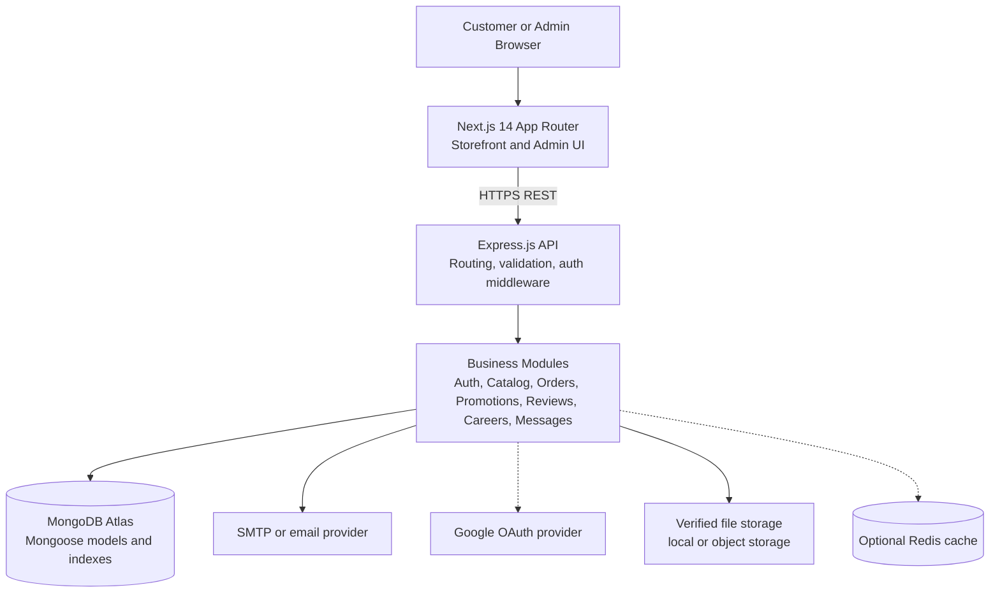

# ShajSutro — System Architecture

## 1. Architectural style

Use a modular monolith with clear separation between presentation, API, business modules, persistence, external adapters, and observability. Keep module boundaries strong enough to support later extraction, but do not describe the system as microservices unless independently deployable services actually exist.

## 2. Logical layers

- **Presentation:** Next.js routes, server/client components, forms, loading boundaries, error boundaries, and admin layouts.
- **API boundary:** Express routers, validation, authentication, authorization, rate limits, error mapping, and response shaping.
- **Application modules:** auth, users, catalog, categories, cart, orders, promotions, reviews, careers, messages, notifications, and analytics.
- **Persistence:** Mongoose schemas, indexes, transactions where supported, aggregation pipelines, and repository/service functions.
- **Adapters:** email, OAuth, PDF generation, payment verification, storage, and optional cache adapters.
- **Observability:** structured logs, request IDs, error tracking, health checks, audit events, and business metrics.

## 3. Core data model

- `User`: identity, role, verification state, profile, addresses, block state, and password-change timestamp.
- `PendingUser`: unverified registration state, OTP metadata, expiry, and attempt counter.
- `Category`: name, slug, description, image, visibility, and optional parent.
- `Product`: name, slug, SKU, category, description, media, variants, price, stock, badges, ratings, and visibility.
- `Order`: customer reference, immutable item snapshots, shipping-address snapshot, payment fields, totals, fulfillment status, and status history.
- `Review`: product, customer, optional order reference, rating, comment, moderation state, and timestamps.
- `PromoCode`: code, discount rules, date window, usage limit, active state, and usage count.
- `Job` and `JobApplication`: public position data, applicant data, resume reference, status, and retention metadata.
- `Message`, `Subscriber`, and `Notification`: support, marketing consent, and operational communication records.

## 4. API boundary

Group routes by business capability:

- `/api/auth`
- `/api/users`
- `/api/products`
- `/api/categories`
- `/api/cart`
- `/api/orders`
- `/api/promo-codes`
- `/api/reviews`
- `/api/job-applications`
- `/api/contact`
- `/api/newsletter`
- `/api/notifications`
- `/api/stats`

Every route should define authentication requirements, authorization rules, input schema, output schema, error cases, rate-limit policy, and audit requirements.

## 5. Critical data flows

### Checkout

1. Client submits product identifiers, variant identifiers, quantities, address, promo code, and payment details.
2. API authenticates or applies the guest-order policy.
3. API loads current products and validates visibility, variants, and stock.
4. API calculates item totals, discount, delivery fee, tax/VAT policy, and final total.
5. API creates the order with immutable item and address snapshots.
6. API decrements or reserves stock using a safe update or transaction strategy.
7. API records payment state and transaction evidence without trusting client totals.
8. API emits confirmation work and returns the order identifier.

### Admin status update

1. API authenticates the staff member.
2. Permission middleware checks the relevant module permission.
3. Service validates the current and requested state transition.
4. Service writes the new status and an audit event.
5. Notification work runs only if configured and succeeds independently of the core state change.

## 6. Reliability and operational controls

- Health endpoint for API and database connectivity.
- Request correlation ID across frontend, API, logs, and notifications.
- Centralized error format without stack traces in production responses.
- Idempotency protection for order creation and payment verification.
- Database indexes for product search fields, order lookups, status filters, and unique identifiers.
- Backups and restore drills for MongoDB data.
- Separate development, staging, and production environment variables.
- Deployment checklist covering CORS, secrets, mail, storage, database, and frontend-backend URLs.

## 7. Architecture decisions to verify

- Whether the backend is deployed as one Express service or multiple independently deployed services.
- Whether Redis is active or only planned.
- Whether uploads use local disk or object storage.
- Whether PDF generation, Google OAuth, email, and payment verification work in the current repository.
- Whether the frontend and backend are deployed and connected in a production environment.
